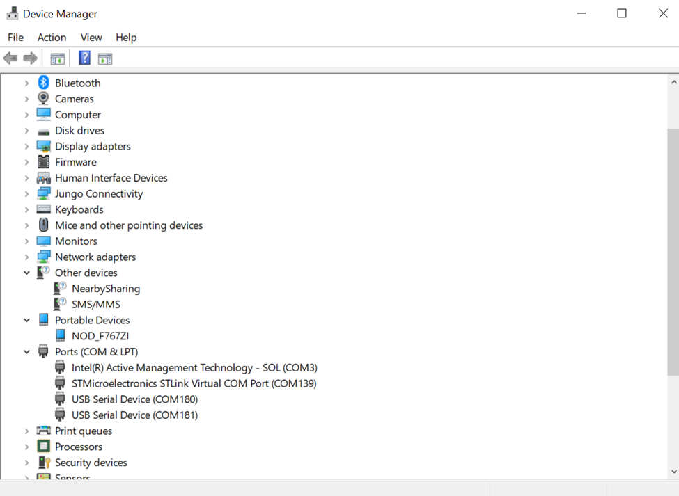

 # F7 DUAL CDC USB Device Composite Application on STM32F7

In this repository : 

* This application provides a C code example showing on how to use the legacy USB Middleware to develop a USB Device Composite application, based on the article published here [How to implement a dual CDC ACM USB device using the ST classic library](https://community.st.com/t5/stm32-mcus/how-to-implement-a-dual-cdc-acm-usb-device-using-the-st-classic/ta-p/708039).

>
* The application is designed to open two Virtual COM Ports through the CDC Class. The main purpose of the application is to provide a functional example for opening more than a CDC class in a single USB Application.

### <b>Prerequisites</b>

This project utilizes the following software and hardware environment:

- NUCLEO-F767 board
- EWARM v9.50.2 
- STM32CubeMX V6.12.0

### <b>Application</b>

   At the beginning of the application, the USB Stack is started and the CDC classes are registered. Following that, the USB Device peripheral in Full-Speed mode is started.
   Once all this process is done, the application monitors in Device Manager two different com ports.
   The CDC message can be saw through a Virtual COM Port terminal if needed.

### <b>Keywords</b>

USB, Device, FS, CDC, Virtual COM Port
### <b>Hardware Setup</b>

  - This application runs on STM32F767xx devices.
  - This application has been tested with STMicroelectronics STM32F767-Nucleo board and can be easily tailored to any other supported device 
    and development board.
  - STM32F767-Nucleo set up
      - Connect the STM32746G-Discovery board to the PC through 'USB micro A-Male 
      to A-Male' cable to the connector:
            - CN3: to use USB Full Speed (FS)
### <b>How to use it</b>

In order to make the program work, you must do the following :
 - Open your preferred toolchain 
 - Rebuild all files and load your image into target memory
 - In the workspace toolbar select the project configuration:
 - Run the application
 - Install the USB virtual COM port driver
 - Find out the number of the COM ports assigned to the STM32 CDC device using device manager
### <b>Directory contents</b>

   Here are the list of the most relevant files for the application. The other files are Read Only or were not modified to build the application.
```c Directory contents

  F767_DualCDC\Core\Src\main.c                  Main program
  F767_DualCDC\Core\Src\stm32f7xx_hal_msp.c     MSP Initialization file
  F767_DualCDC\Core_\Src\system_stm32f7xx.c     STM32F7xx system clock configuration file
  F767_DualCDC\Core\Src\stm32f7xx_it.c          Interrupt handlers
  F767_DualCDC\USB_DEVICE\App\usbd_desc.c       USB device CDC descriptor
  F767_DualCDC\USB_DEVICE\App\usbd_cdc_if.c     USB device CDC Interface for VCP
  F767_DualCDC\USB_DEVICE\App\usb_device.c      USB device CDC Intialization
  F767_DualCDC\USB_DEVICE\Target\usbd_conf.c    General low level driver configuration
  F767_DualCDC\Core\Inc\main.h                  Main program header file
  F767_DualCDC\Core\Inc\stm32f7xx_it.h          Interrupt handlers header file
  F767_DualCDC\Core\Inc\stm32f7xx_hal_conf.h    HAL configuration file
  F767_DualCDC\Core\Inc\usbd_conf.h             USB device driver Configuration file
  F767_DualCDC\USB_DEVICE\App\usbd_desc.c       USB device MSC descriptor header file
  F767_DualCDC\USB_DEVICE\App\usbd_cdc_if.c     USB device CDC Interface for VCP header file 
  F767_DualCDC\USB_DEVICE\App\usb_device.c      USB device CDC Intialization header file
  F767_DualCDC\USB_DEVICE\Target\usbd_conf.c    General low level driver configuration header file
```
### <b>Explanation</b>

During enumeration phase, three communication pipes "endpoints" are declared for each CDC instance. 

At the beginning of the main program the HAL_Init() function is called to reset all the peripherals,
initialize the Flash interface and the systick. 

The user is provided with the SystemClock_Config()
function to configure the system clock (SYSCLK) to run at 216 MHz. 

The Full Speed (FS) USB module uses
internally a 48-MHz clock which is coming from a specific output of two PLLs: main PLL or PLL SAI.

In case using High Speed (HS) mode the USB clock (60 MHz) shall be driven by the ULPI.

### <b>Expected Behavior</b>

When the VCP application is started, the STM32 MCU is enumerated as serial communication port and is
configured in the same way (baudrate, data format, parity, stop bit) as it would configure a standard 
COM port. 

The 7-bit data length with no parity control is NOT supported.


Checking device manager




